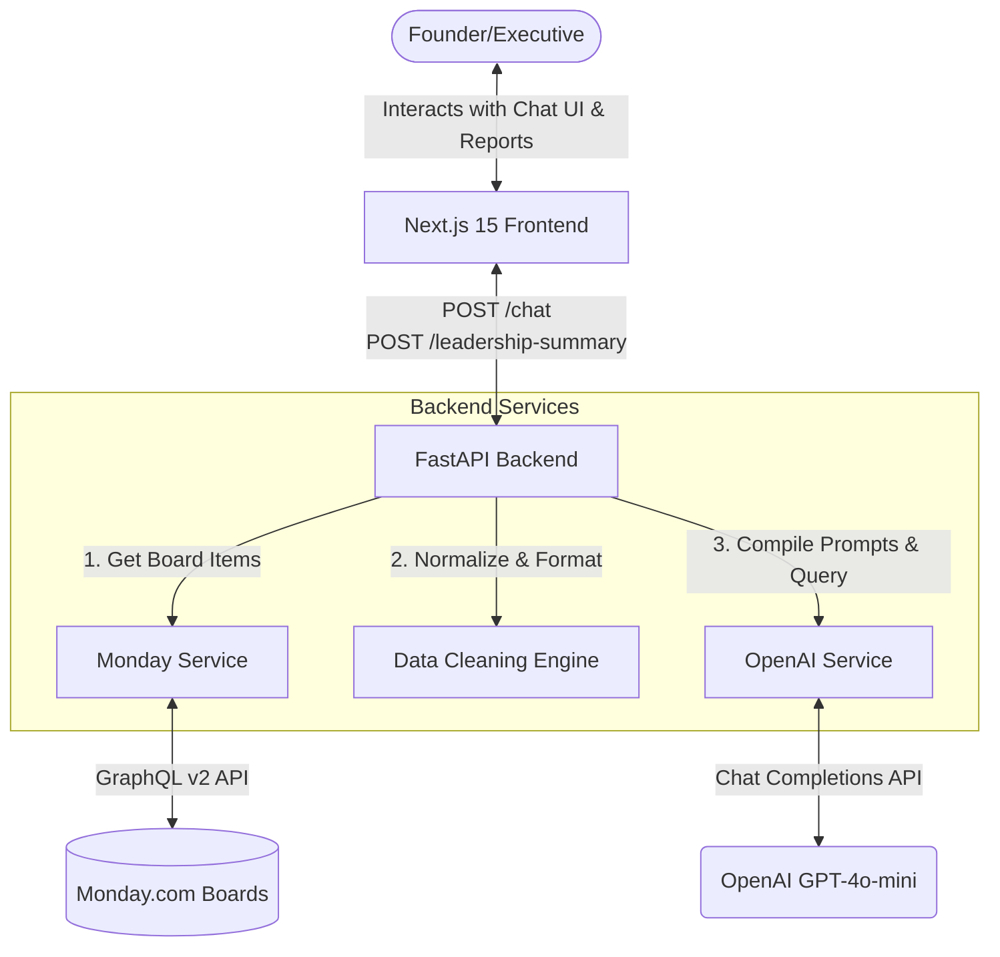

# Architecture Design - monday-bi-agent

This document outlines the system architecture, component breakdown, and data flow pipelines for the Monday.com Business Intelligence Agent.

## 1. System Overview

The system is split into a client-server model designed to retrieve, clean, aggregate, and analyze project tracking data from monday.com using OpenAI's GPT models.

## 2. Component Breakdown

### A. Next.js 15 Frontend Client
* **Tech Stack**: React, TypeScript, Tailwind CSS, Lucide Icons.
* **Responsibilities**:
  * Render the SaaS Dashboard interface.
  * Manage message history state.
  * Serve suggested starting questions and display board diagnostics.
  * Render Markdown tables and reports compiled by the backend.
  * Facilitate downloading reports as local Markdown files.

### B. FastAPI Backend Server
* **Tech Stack**: Python 3.12, Uvicorn, Pydantic, HTTPX.
* **Responsibilities**:
  * Expose REST endpoints (`/api/chat`, `/api/leadership-summary`, `/api/boards`, `/health`).
  * Enforce schema validation on payloads.
  * Orchestrate calls to external APIs.

### C. Data Cleaning Engine (`data_cleaning.py`)
* **Responsibilities**:
  * Map dynamic Monday column IDs to logical business variables.
  * Clean currencies, spaces, and parse dates under multiple standard format trials.
  * Deduplicate and normalize customer company accounts (e.g. converting suffix variances).
  * Record warnings and flags for missing metrics.

### D. OpenAI Service (`openai_service.py`)
* **Responsibilities**:
  * Aggregate raw list items into exact KPIs in Python.
  * Inject the computed KPIs alongside the cleaned board tables into GPT prompts.
  * Maintain system prompts constraining formatting and personas.

## 3. Data Flow Pipeline

```mermaid
sequenceDiagram
    autonumber
    actor User as Founder
    participant FE as Frontend Client
    participant BE as FastAPI Backend
    participant MS as Monday Service
    participant DC as Data Cleaning Engine
    participant OS as OpenAI Service
    
    User->>FE: Ask "How is our pipeline?"
    FE->>BE: POST /api/chat { query, history }
    
    rect rgb(30, 30, 45)
        note right of BE: Ingestion & Verification
        BE->>MS: Fetch Boards (Deals & Work Orders)
        MS->>BE: Raw Boards JSON (with pagination cursors)
    end
    
    rect rgb(20, 40, 20)
        note right of BE: Clean & Normalize
        BE->>DC: Parse and Clean Raw Records
        DC-->>BE: Cleaned Lists + Diagnostic Warnings
    end
    
    rect rgb(45, 30, 30)
        note right of BE: Analysis & GPT Reasoning
        BE->>OS: Compile prompt with history & metrics
        OS->>BE: GPT Response (Markdown)
    end
    
    BE->>FE: Return { response, warnings }
    FE->>User: Display Answer (Markdown) + Expandable Warnings Box
```

## 4. Security Considerations

1. **API Keys Protection**: All tokens (`MONDAY_API_KEY`, `OPENAI_API_KEY`) are kept on the server environment. The client browser never receives or exposes these tokens.
2. **CORS Restrictions**: CORS configurations can restrict incoming origins to specific domain names in production deployments.
3. **Stateless Operations**: No board data or chat history is stored on the backend disk, preventing intermediate data leaks.
